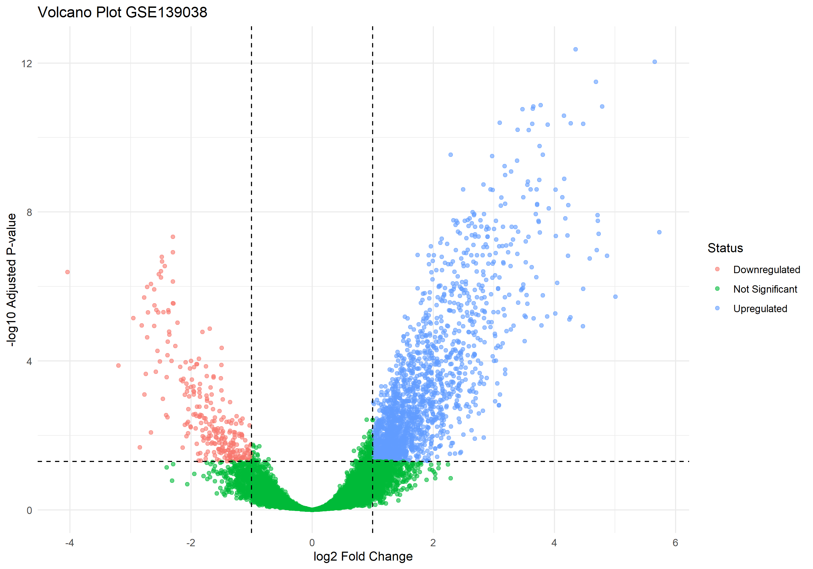
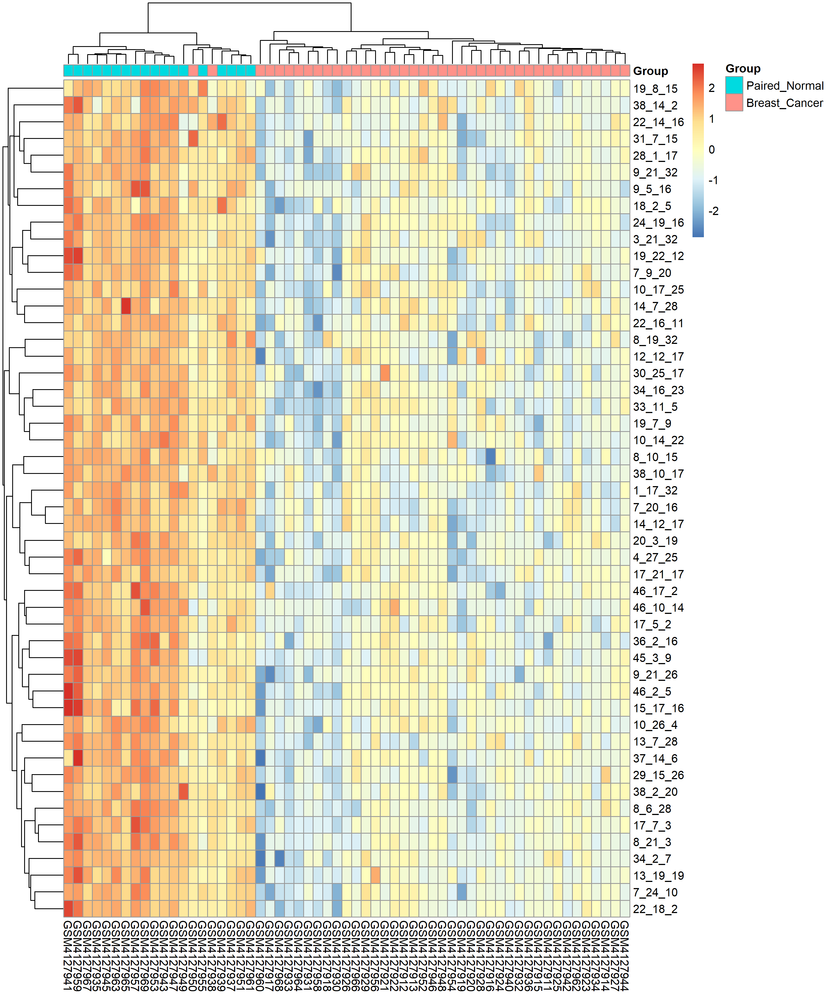
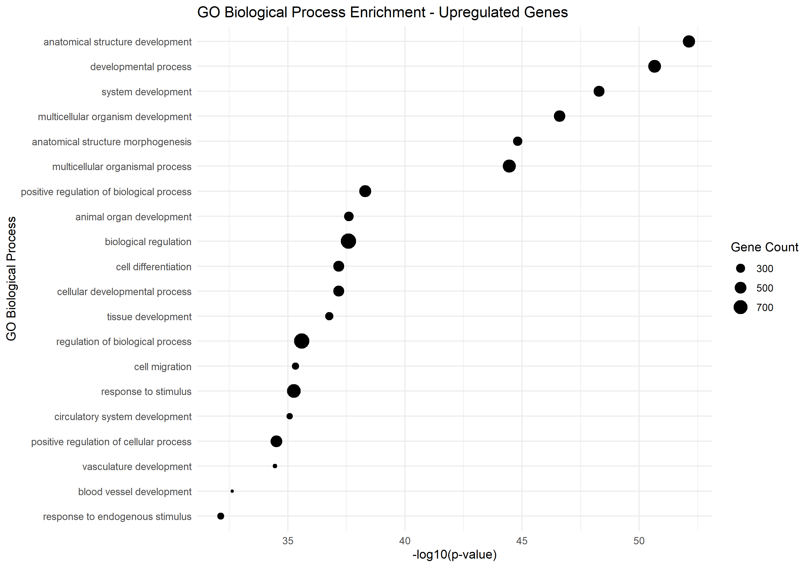
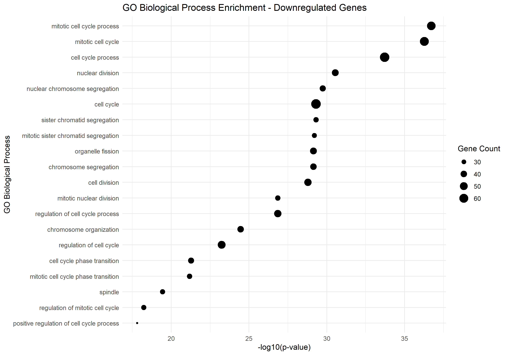
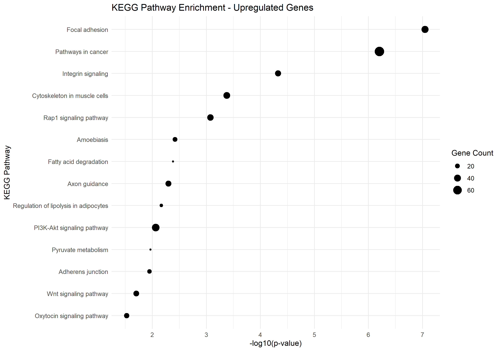
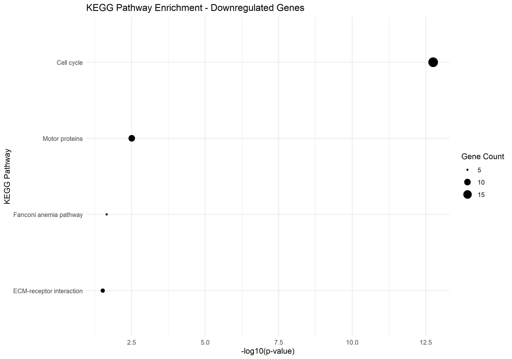

# Made-Kensu-Pratama_Week-3
# Made-Kensu-Pratama_Week-3

Analisis *Differential Gene Expression* (DEG) dan *Functional Enrichment* pada data ekspresi gen kanker payudara, dataset **GSE139038** dari Gene Expression Omnibus (GEO).

## Pendahuluan

Kanker payudara merupakan salah satu jenis kanker dengan heterogenitas molekuler yang tinggi, sehingga identifikasi gen-gen yang berekspresi berbeda antara jaringan tumor dan jaringan normal menjadi penting untuk memahami mekanisme biologis yang mendasarinya. Analisis ini bertujuan untuk mengidentifikasi gen yang terekspresi secara diferensial antara sampel *breast cancer* dan *paired normal* pada dataset GSE139038, serta mengeksplorasi jalur biologis (*biological pathway*) yang terlibat melalui analisis *functional enrichment*.

## Metode

Data ekspresi gen diunduh dari GEO menggunakan paket `GEOquery` pada platform GPL27630, yang mencakup 65 sampel jaringan payudara. Sampel kemudian difilter untuk hanya menyertakan kelompok *Breast Cancer* (n = 41) dan *Paired Normal* (n = 18), sehingga kelompok *Apparent Normal* (n = 6) dikeluarkan dari analisis.

Analisis DEG dilakukan menggunakan paket `limma` dengan pendekatan *linear model* dan kontras antara kelompok *Paired Normal* dan *Breast Cancer*. Gen dikategorikan signifikan apabila memiliki nilai *adjusted p-value* (BH) < 0,05 dengan *log fold change* (logFC) ≥ 1 untuk kategori upregulasi atau ≤ -1 untuk downregulasi. Anotasi probe ke simbol gen dilakukan menggunakan tabel platform GPL27630.

Analisis *functional enrichment* pada gen-gen signifikan dilakukan menggunakan paket `gprofiler2`, mencakup analisis *Gene Ontology* (GO Biological Process) dan *KEGG Pathway*, dengan metode koreksi *false discovery rate* (FDR).

## Hasil

Analisis DEG mengidentifikasi 1.842 gen unik yang terekspresi secara signifikan berbeda antara kelompok *Breast Cancer* dan *Paired Normal*, terdiri dari 1.601 gen upregulasi dan 241 gen downregulasi. Distribusi perubahan ekspresi gen divisualisasikan melalui *volcano plot* (`plot/volcano_plot.png`), sementara pola ekspresi 50 probe paling signifikan ditampilkan melalui *heatmap* (`plot/heatmap_top50_DEG.png`).





Analisis GO Biological Process pada gen upregulasi menunjukkan enrichment pada terma yang berkaitan dengan perkembangan struktur anatomis dan diferensiasi sel, sedangkan gen downregulasi didominasi oleh terma yang berkaitan dengan siklus sel dan pembelahan sel, konsisten dengan karakteristik proliferasi sel kanker.





Analisis KEGG Pathway pada gen upregulasi menunjukkan jalur teratas berupa *Focal Adhesion* dan *Pathways in Cancer*, sementara gen downregulasi didominasi oleh jalur *Cell Cycle* dengan nilai signifikansi tertinggi di antara seluruh jalur yang teridentifikasi.





## Kesimpulan

Analisis ini mengidentifikasi perbedaan ekspresi gen yang signifikan antara jaringan kanker payudara dan jaringan normal berpasangan pada dataset GSE139038. Gen yang mengalami downregulasi pada jaringan kanker menunjukkan asosiasi dominan dengan jalur siklus sel, sedangkan gen yang mengalami upregulasi menunjukkan asosiasi dengan jalur adhesi fokal dan jalur kanker secara umum. Temuan ini mendukung pemahaman bahwa disregulasi siklus sel dan adhesi seluler merupakan komponen penting dalam patogenesis kanker payudara pada dataset yang dianalisis.

## Struktur Repository

```
├── README.md
├── script/
│   └── analisis_DEG_GSE139038.R
├── data/
│   ├── DEG_GSE139038_annotated.csv
│   ├── upregulated_genes.csv
│   └── downregulated_genes.csv
└── plot/
    ├── volcano_plot.png
    ├── heatmap_top50_DEG.png
    ├── GO_BP_upregulated.png
    ├── GO_BP_downregulated.png
    ├── KEGG_upregulated.png
    └── KEGG_downregulated.png
```

## Sumber Data

Dataset: [GSE139038](https://www.ncbi.nlm.nih.gov/geo/query/acc.cgi?acc=GSE139038) — Gene Expression Omnibus (GEO)
Platform: GPL27630
